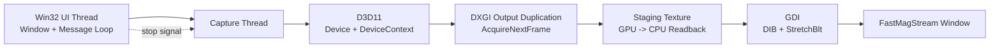

# FastMagStream

Real-time magnified screen viewer for Windows using the DXGI Desktop Duplication API (`D3D11`/`DXGI`) plus `GDI` presentation. FastMagStream uses `D3D11` to create the GPU device and device context used for desktop frame access through `DXGI` Output Duplication. Captured frames are read back through a staging texture and presented as a magnified view in the application window via `GDI` (`StretchBlt`).

## Architecture Diagram



## Configuration (TOML)

Configuration is mandatory and must be passed using `--config <path>`.

Required keys:

- `display_width`
- `display_height`
- `record_width`
- `record_height`
- `zoom_factor`
- `frames_per_second`

Example `fastmagstream.toml`:

```toml
display_width = 1920
display_height = 1080
record_width = 2560
record_height = 1440
zoom_factor = 2.0
frames_per_second = 60
```

Run example:

```powershell
.\FastMagStream.exe --config .\fastmagstream.toml
```

## Build

- Project: Visual Studio C++ project (`FastMagStream.vcxproj`)
- Dependencies: Windows SDK (`d3d11.lib`, `dxgi.lib`) and vendored `toml++` header
- Platform: Windows (Desktop Duplication requires Windows 8+)
