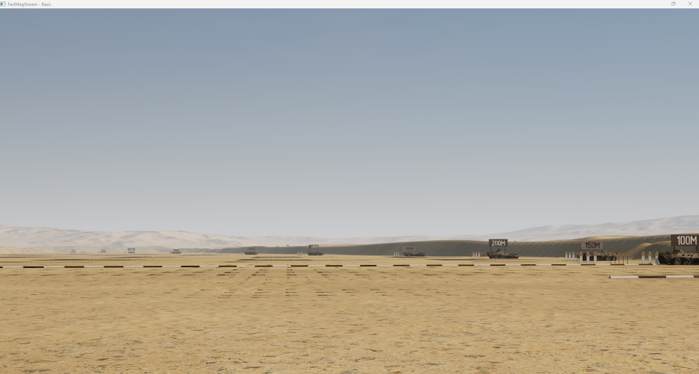
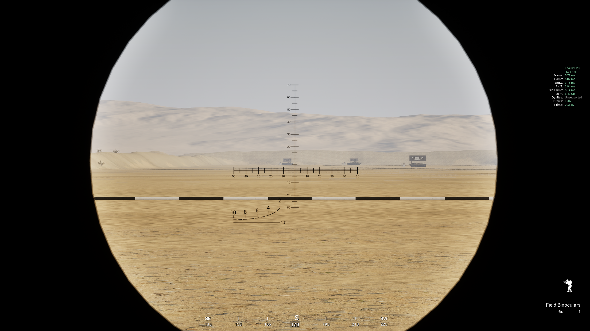
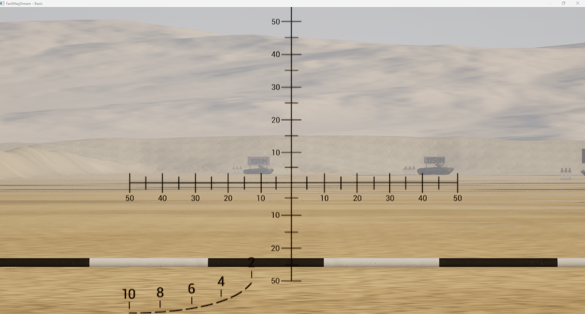
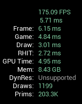

# FastMagStream

Real-time magnified screen capture for Windows using the DXGI Desktop Duplication API (`D3D11`/`DXGI`) with `GDI` presentation. The project is structured around a reusable core library that owns capture, frame transfer, and present flow, while allowing optional extension points.

## Architecture Diagram

```mermaid
flowchart LR
    UI["Win32 UI Thread<br/>Window + Message Loop"]
    CAP["Capture Thread"]

    D3D["D3D11<br/>Device + DeviceContext"]
    DXGI["DXGI Output Duplication<br/>AcquireNextFrame"]
    STAGE["Staging Texture<br/>GPU -> CPU Readback"]
    HOOK["Optional Hook<br/>Overlay Callback"]
    GDI["GDI<br/>DIB + StretchBlt"]
    WIN["FastMagStream Window"]

    UI --> CAP
    CAP --> D3D --> DXGI --> STAGE --> HOOK --> GDI --> WIN
    UI -."stop signal".-> CAP
```




## Configuration (TOML)

Configuration is mandatory and must be passed using `--config <path>`.

Required keys:

- `display_width`
- `display_height`
- `record_width`
- `record_height`
- `zoom_factor`
- `frames_per_second`

Optional:

- `behaviour`: `"crosshairs"` to draw centre crosshairs; `"flex"` for interactive pause and zoom (see below); omit or leave empty for no overlay.

When `behaviour = "flex"`:

- **F1**: toggle stream on/off (black screen when off).
- **F2**: toggle zoom-input mode. When on, numpad 1–9 set a zoom multiplier.
- **Numpad 1–9** (with F2 on): set multiplier applied to the TOML `zoom_factor` (effective zoom = `zoom_factor × multiplier`). Multipliers: 1→1.0, 2→1.25, 3→1.5, 4→1.75, 5→2.0, 6→2.25, 7→2.5, 8→2.75, 9→3.0. Example: `zoom_factor = 2` and numpad 3 → effective zoom 3.

Example `fastmagstream.toml`:

```toml
display_width = 1920
display_height = 1080
record_width = 2560
record_height = 1440
zoom_factor = 2.0
frames_per_second = 60
# behaviour = "crosshairs"
# behaviour = "flex"
```

Run:

```powershell
.\FastMagStream.exe --config .\fastmagstream.toml
```

## Zoom Showcase

| Normal Zoom | 2x Zoom |
|---|---|
|  |  |

| Bino Normal Zoom | Bino 2x Zoom |
|---|---|
|  |  |

| Bino Normal Zoom | Bino 2x Zoom |
|---|---|
|  |  |

| Non affected frame rate |
|---|
|  |

## Build

- Solution: `FastMagStream.slnx` (includes executable + core library projects)
- Dependencies: Windows SDK (`d3d11.lib`, `dxgi.lib`) and vendored `toml++` header
- Platform: Windows (Desktop Duplication requires Windows 8+)
